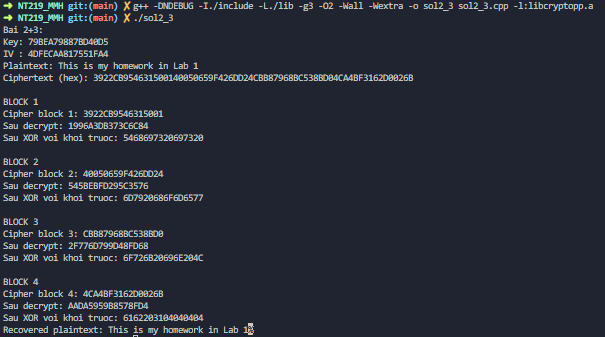
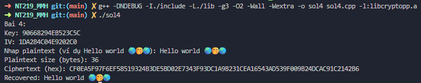
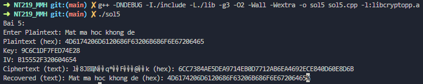
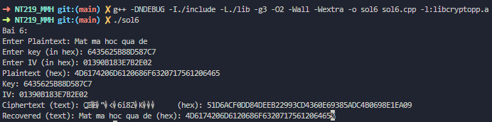
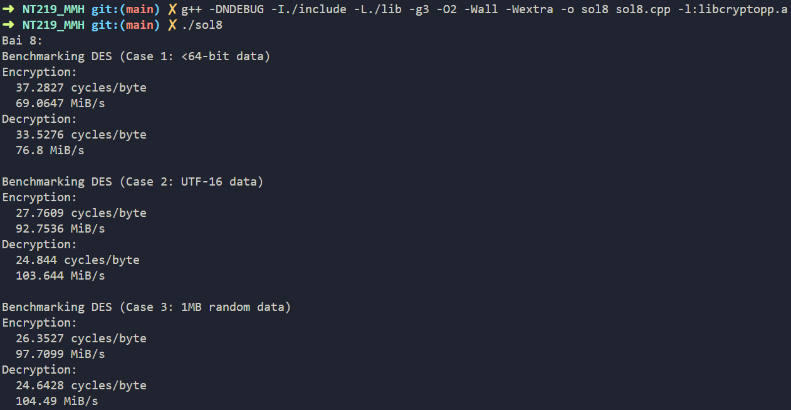
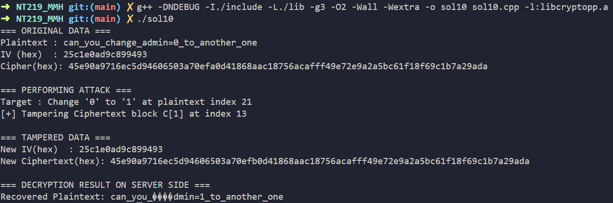

# Mật mã học - NT219.Q11.ANTN.1 - Lab 1

## Báo cáo thực hành Lab 1
### 1. DES::DEFAULT_KEYLENGTH và DES::BLOCKSIZE bằng bao nhiêu?
```cpp
#include <cryptopp/des.h>
#include <bits/stdc++.h>

using namespace CryptoPP;
using namespace std;

int main() {
    cout << "Bai 1: \n";
    cout << "DES key length: " << DES::DEFAULT_KEYLENGTH << '\n';
    cout << "Block size of DES: " << DES::BLOCKSIZE << '\n';
    return 0;
}
```
```
Bai 1: 
DES key length: 8
Block size of DES: 8
```
### 2 + 3. Debug chương trình và ghi nhận lại hoạt động chính trong quá trình mã hoá của DES với mode CBC
```cpp
#include <cryptopp/des.h>
#include <cryptopp/modes.h>
#include <cryptopp/filters.h>
#include <cryptopp/secblock.h>
#include <cryptopp/osrng.h>
#include <cryptopp/hex.h>
#include <bits/stdc++.h>

using namespace CryptoPP;
using namespace std;

int main() {
    cout << "Bai 2+3: \n";
    AutoSeededRandomPool prng;
    SecByteBlock key(DES::DEFAULT_KEYLENGTH);
    prng.GenerateBlock(key, key.size());

    CryptoPP::byte iv[DES::BLOCKSIZE];
    prng.GenerateBlock(iv, sizeof(iv));

    string encodedKey, encodedIV;
    StringSource(key, key.size(), true, new HexEncoder(new StringSink(encodedKey)));
    StringSource(iv, sizeof(iv), true, new HexEncoder(new StringSink(encodedIV)));

    cout << "Key: " << encodedKey << endl;
    cout << "IV : " << encodedIV << endl;

    string plain = "This is my homework in Lab 1";
    string cipher;

    CBC_Mode<DES>::Encryption e;
    e.SetKeyWithIV(key, key.size(), iv);
    StringSource(plain, true, new StreamTransformationFilter(e, new StringSink(cipher)));

    string encodedCipher;
    StringSource(cipher, true, new HexEncoder(new StringSink(encodedCipher)));
    cout << "Plaintext: " << plain << endl;
    cout << "Ciphertext (hex): " << encodedCipher << endl;
    
    vector<unsigned char> cipherVec(cipher.begin(), cipher.end());
    
    DES::Decryption d;
    d.SetKey(key, key.size());

    vector<unsigned char> prev_block(iv, iv + DES::BLOCKSIZE);
    string recovered;

    for (size_t i = 0; i < cipherVec.size(); i += DES::BLOCKSIZE) {
        unsigned char current_block[DES::BLOCKSIZE];
        memcpy(current_block, cipherVec.data() + i, DES::BLOCKSIZE);
        cout << "\nBLOCK " << (i / DES::BLOCKSIZE) + 1 << endl;
        
        string current_block_hex;
        StringSource(current_block, DES::BLOCKSIZE, true, new HexEncoder(new StringSink(current_block_hex)));
        cout << "Cipher block " << (i / DES::BLOCKSIZE) + 1 << ": " << current_block_hex << endl;

        vector<unsigned char> original_cipher_block(current_block, current_block + DES::BLOCKSIZE);
        d.ProcessBlock(current_block);

        current_block_hex.clear();
        StringSource(current_block, DES::BLOCKSIZE, true, new HexEncoder(new StringSink(current_block_hex)));
        cout << "Sau decrypt: " << current_block_hex << endl;

        for (size_t j = 0; j < DES::BLOCKSIZE; j++)
            current_block[j] ^= prev_block[j];

        current_block_hex.clear();
        StringSource(current_block, DES::BLOCKSIZE, true, new HexEncoder(new StringSink(current_block_hex)));
        cout << "Sau XOR voi khoi truoc: "<< current_block_hex << endl;

        recovered.append((char*)current_block, DES::BLOCKSIZE);
        prev_block = original_cipher_block;
    }
    size_t padLen = recovered.back();
    recovered.resize(recovered.size() - padLen);
    cout << "Recovered plaintext: " << recovered;
    
    return 0;
}
```


### 4. plaintext hỗ trợ đầu vào bao gồm các kí tự thuộc UTF-16
```cpp
#include <cryptopp/des.h>
#include <cryptopp/modes.h>
#include <cryptopp/filters.h>
#include <cryptopp/secblock.h>
#include <cryptopp/osrng.h>
#include <cryptopp/hex.h>
#include <bits/stdc++.h>
#include <codecvt>

using namespace CryptoPP;
using namespace std;

int main() {
    cout << "Bai 4: \n";
    AutoSeededRandomPool prng;

    SecByteBlock key(DES::DEFAULT_KEYLENGTH);
    prng.GenerateBlock(key, key.size());

    CryptoPP::byte iv[DES::BLOCKSIZE];
    prng.GenerateBlock(iv, sizeof(iv));

    string encodedKey, encodedIV;
    StringSource(key, key.size(), true, new HexEncoder(new StringSink(encodedKey)));
    StringSource(iv, sizeof(iv), true, new HexEncoder(new StringSink(encodedIV)));
    cout << "Key: " << encodedKey << "\nIV: " << encodedIV << '\n';
    wstring_convert<codecvt_utf8_utf16<char16_t>, char16_t> convert;
    string input;
    cout << "Nhap plaintext (ví dụ Hello world 🌏🤭🌏): ";
    getline(cin, input);  // đọc UTF-8

    u16string u16_plain = convert.from_bytes(input);
    string plain(reinterpret_cast<const char*>(u16_plain.data()), u16_plain.size() * sizeof(char16_t));
    cout << "Plaintext size (bytes): " << plain.size() << endl;

    CBC_Mode<DES>::Encryption e;
    e.SetKeyWithIV(key, key.size(), iv);
    string cipher, cipher_hex;
    StringSource(plain, true, new StreamTransformationFilter(e, new StringSink(cipher)));
    StringSource(cipher, true, new HexEncoder(new StringSink(cipher_hex)));
    cout << "Ciphertext (hex): " << cipher_hex << endl;

    CBC_Mode<DES>::Decryption d;
    d.SetKeyWithIV(key, key.size(), iv);
    string recovered;
    StringSource(cipher, true, new StreamTransformationFilter(d, new StringSink(recovered)));
    u16string u16_recovered(reinterpret_cast<const char16_t*>(recovered.data()), recovered.size() / sizeof(char16_t));
    recovered = convert.to_bytes(u16_recovered);
    cout << "Recovered: " << recovered << endl;
    return 0;
}

```

### 5. Đầu vào plaintext được nhập thủ công vào chương trình
```cpp
#include <cryptopp/des.h>
#include <cryptopp/modes.h>
#include <cryptopp/filters.h>
#include <cryptopp/secblock.h>
#include <cryptopp/osrng.h>
#include <cryptopp/hex.h>
#include <bits/stdc++.h>

using namespace CryptoPP;
using namespace std;

int main() {
    cout << "Bai 5: \n";
    string plain, plain_hex;
    cout <<"Enter Plaintext: ";
    getline(cin, plain);
    StringSource(plain, true, new HexEncoder(new StringSink(plain_hex)));
    cout << "Plaintext (hex): " << plain_hex << '\n';

    AutoSeededRandomPool prng;

    SecByteBlock key(DES::DEFAULT_KEYLENGTH);
    prng.GenerateBlock(key, key.size());

    CryptoPP::byte iv[DES::BLOCKSIZE];
    prng.GenerateBlock(iv, sizeof(iv));

    string encodedKey, encodedIV;
    StringSource(key, key.size(), true, new HexEncoder(new StringSink(encodedKey)));
    StringSource(iv, sizeof(iv), true, new HexEncoder(new StringSink(encodedIV)));
    cout << "Key: " << encodedKey << "\nIV: " << encodedIV << '\n';

    CBC_Mode<DES>::Encryption e;
    e.SetKeyWithIV(key, key.size(), iv);
    string cipher, cipher_hex;
    StringSource(plain, true, new StreamTransformationFilter(e, new StringSink(cipher)));
    StringSource(cipher, true, new HexEncoder(new StringSink(cipher_hex)));
    cout << "Ciphertext (text): " << cipher << " (hex): " << cipher_hex << '\n';

    CBC_Mode<DES>::Decryption d;
    d.SetKeyWithIV(key, key.size(), iv);
    string recovered, recovered_hex;
    StringSource(cipher, true, new StreamTransformationFilter(d, new StringSink(recovered)));
    StringSource(recovered, true, new HexEncoder(new StringSink(recovered_hex)));
    cout << "Recovered (text): " << recovered << " (hex): " << recovered_hex;
    
    return 0;
}
```

### 6. Secret Key và IV nhập vào thủ công từ chương trình
```cpp
#include <cryptopp/des.h>
#include <cryptopp/modes.h>
#include <cryptopp/filters.h>
#include <cryptopp/secblock.h>
#include <cryptopp/hex.h>
#include <bits/stdc++.h>

using namespace CryptoPP;
using namespace std;

int main() {
    cout << "Bai 6: \n";
    string plain, plain_hex;
    cout <<"Enter Plaintext: ";
    getline(cin, plain);
    StringSource(plain, true, new HexEncoder(new StringSink(plain_hex)));

    SecByteBlock key(DES::DEFAULT_KEYLENGTH);
    CryptoPP::byte iv[DES::BLOCKSIZE];
    string keyHex, ivHex;
    cout <<"Enter key (in hex): "; cin >> keyHex;
    cout<<"Enter IV (in hex): "; cin >> ivHex;
    StringSource(keyHex, true, new HexDecoder(new ArraySink(key, sizeof(key))));
    StringSource(ivHex, true, new HexDecoder(new ArraySink(iv, sizeof(iv))));
    cout << "Plaintext (hex): " << plain_hex << '\n';
    cout << "Key: " << keyHex << "\nIV: " << ivHex << '\n';

    CBC_Mode<DES>::Encryption e;
    e.SetKeyWithIV(key, key.size(), iv);
    string cipher, cipher_hex;
    StringSource(plain, true, new StreamTransformationFilter(e, new StringSink(cipher)));
    StringSource(cipher, true, new HexEncoder(new StringSink(cipher_hex)));
    cout << "Ciphertext (text): " << cipher << " (hex): " << cipher_hex << '\n';

    CBC_Mode<DES>::Decryption d;
    d.SetKeyWithIV(key, key.size(), iv);
    string recovered, recovered_hex;
    StringSource(cipher, true, new StreamTransformationFilter(d, new StringSink(recovered)));
    StringSource(recovered, true, new HexEncoder(new StringSink(recovered_hex)));
    cout << "Recovered (text): " << recovered << " (hex): " << recovered_hex;
    
    return 0;
}
```

### 7. Tìm hiểu về tấn công Differential cryptanalysis  attack và Linear cryptanalysis attack (hiện thực nếu có thể).
#### Differential cryptanalysis
Differential cryptanalysis được Eli Biham và Adi Shamir tìm ra vào cuối những năm 1980 mặc dù nó đã được IBM và NSA biết đến trước đó. Để phá mã DES với đủ 16 chu trình, phá mã vi sai cần đến $2^{47}$ văn bản rõ. DES đã được thiết kế để chống lại tấn công dạng này.

Đây là một phương pháp phân tích mật mã cực kỳ hiệu quả, chủ yếu được áp dụng cho các thuật toán mã hóa khối. Mục tiêu là khai thác các điểm yếu thống kê trong cấu trúc của thuật toán để tìm ra khóa mã hóa nhanh hơn đáng kể.

Differential cryptanalysis thường là Chosen-Plaintext Attack, nghĩa là kẻ tấn công có quyền lựa chọn các bản rõ (plaintext) mà mình muốn, sau đó đưa chúng vào  mã hóa và nhận lại các bản mã (ciphertext) tương ứng. Với vai trò là người tấn công, ta không chọn các bản rõ một cách ngẫu nhiên mà tạo ra các cặp bản rõ có một mối quan hệ toán học đặc biệt với nhau.

Hiệu số được tính bằng nhiều cách, thường là kết quả của phép XOR.
Kẻ tấn công sẽ chuẩn bị một cặp bản rõ $P_1$ và $P_2$.
Sau đó, họ tính "hiệu số đầu vào" là $\Delta P = P_1 \oplus P_2$. Tiếp theo, họ lấy hai bản mã tương ứng $C_1$ và $C_2$ rồi tính "hiệu số đầu ra" là $\Delta C = C_1 \oplus C_2$.
Cuối cùng là nghiên cứu xem một $\Delta P$ cụ thể có xu hướng tạo ra một $\Delta C$ cụ thể nào đó thường xuyên hơn mức ngẫu nhiên hay không. Cặp $(\Delta P, \Delta C)$ này được gọi là một "vi sai" (differential).

**S-box** là các bảng thay thế phi tuyến tính được thiết kế để tạo ra sự hỗn loạn, góp phần tạo nên sự bảo mật của các thuật toán như DES. Tuy nhiên, S-box không hoàn hảo vì khi phân tích nó với một "hiệu số đầu vào" nhất định, một số "hiệu số đầu ra" sẽ xuất hiện với xác suất cao hơn hẳn những cái khác.

Đây chính là sự mất cân bằng thống kê có thể khai thác để tấn công.

#### Linear cryptanalysis
Linear cryptanalysis được tìm ra bởi Mitsuru Matsui và nó đòi hỏi $2^{43}$ văn bản rõ. Phương pháp này đã được Matsui thực hiện và là thực nghiệm phá mã đầu tiên được công bố.

Để tấn công cần có một lượng lớn các cặp bản rõ và bản mã tương ứng (plaintext-ciphertext pairs) được mã hóa dưới cùng một khóa bí mật. Mục tiêu của nó không phải là tìm ra một lỗ hổng nghiêm trọng để giải mã trực tiếp, mà là tìm ra một "sự thiên vị" (**bias**) trong hoạt động của thuật toán.

Cốt lõi của phương pháp này là xây dựng một phương trình tuyến tính. Trong mật mã học, "tuyến tính" thường có nghĩa là sử dụng phép XOR và phương trình có dạng tổng quát:
$$
P_{i_1} \oplus P_{i_2} \oplus \dots \oplus C_{j_1} \oplus C_{j_2} \oplus \dots=K_{k_1} \oplus K_{k_2} \oplus \dots
$$

Trong đó:
- $P_i$ là bit thứ i của Plaintext.
- $C_j$ là bit thứ j của Ciphertext.
- $K_k$ là bit thứ k của Key.

Quan trọng là: phương trình này không phải lúc nào cũng đúng mà nó chỉ đúng với một xác suất p. Nếu p = 0.5 thì nó hoàn toàn ngẫu nhiên, ngược lại càng lệch về 0 hoặc 1 thì phương trình càng có tính "thiên vị" và có giá trị cho việc tấn công.
### 8. Đánh giá hiệu năng của thuật toán DES với mode CBC
1. Trường hợp 1: Dữ liệu nhỏ hơn 64-bit
2. Trường hợp 2: Dữ liệu dạng utf-16
3. Trường hợp 3: Dữ liệu lớn hơn 1MB
4. Báo cáo với 2 thông số Cycles Per Byte và MiB/Second. Có thể tham khảo công cụ
đánh giá tại https://www.cryptopp.com/wiki/Benchmarks

```cpp
#include <iostream>
#include <string>
#include <vector>
#include <cryptopp/osrng.h>
#include <cryptopp/des.h>
#include <cryptopp/aes.h>
#include <cryptopp/modes.h>
#include <cryptopp/secblock.h>
#include <cryptopp/hrtimer.h>

using std::cout;
using std::endl;
using std::string;
using std::u16string;

const double MIN_BENCHMARK_TIME = 2.0;
const double CPU_FREQ = 2.7 * 1e9;

template <class T_BLOCK_CIPHER>
void BenchmarkCipher(const string& cipherName, const string& dataLabel, const string& input) {
    cout << "Benchmarking " << cipherName << " (" << dataLabel << ")" << endl;
    
    CryptoPP::AutoSeededRandomPool prng;
    CryptoPP::SecByteBlock key(T_BLOCK_CIPHER::DEFAULT_KEYLENGTH);
    CryptoPP::SecByteBlock iv(T_BLOCK_CIPHER::BLOCKSIZE);
    prng.GenerateBlock(key, key.size());
    prng.GenerateBlock(iv, iv.size());

    string buffer = input;
    {
        typename CryptoPP::CBC_Mode<T_BLOCK_CIPHER>::Encryption enc;
        enc.SetKeyWithIV(key, key.size(), iv);
        
        unsigned long iterations = 0;
        CryptoPP::ThreadUserTimer timer;
        timer.StartTimer();

        do {
            unsigned long runCount = (iterations == 0) ? 1 : iterations;
            for (unsigned long i = 0; i < runCount; ++i) {
                enc.ProcessData(
                    // FIX 2: Chỉ định rõ CryptoPP::byte
                    reinterpret_cast<CryptoPP::byte*>(&buffer[0]),
                    reinterpret_cast<const CryptoPP::byte*>(input.data()),
                    input.size()
                );
            }
            iterations += runCount;
        } while (timer.ElapsedTimeAsDouble() < MIN_BENCHMARK_TIME);

        double elapsed = timer.ElapsedTimeAsDouble();
        double totalBytes = static_cast<double>(input.size()) * iterations;
        double mbs = totalBytes / elapsed / (1024 * 1024);
        double cpb = elapsed * CPU_FREQ / totalBytes;

        cout << "Encryption:" << endl;
        cout << "  " << cpb << " cycles/byte" << endl;
        cout << "  " << mbs << " MiB/s" << endl;
    }


    {
        typename CryptoPP::CBC_Mode<T_BLOCK_CIPHER>::Decryption dec;
        dec.SetKeyWithIV(key, key.size(), iv);

        unsigned long iterations = 0;
        CryptoPP::ThreadUserTimer timer;
        timer.StartTimer();

        do {
            unsigned long runCount = (iterations == 0) ? 1 : iterations;
            for (unsigned long i = 0; i < runCount; ++i) {
                dec.ProcessData(
                    // FIX 2: Chỉ định rõ CryptoPP::byte
                    reinterpret_cast<CryptoPP::byte*>(&buffer[0]),
                    reinterpret_cast<const CryptoPP::byte*>(input.data()),
                    input.size()
                );
            }
            iterations += runCount;
        } while (timer.ElapsedTimeAsDouble() < MIN_BENCHMARK_TIME);

        double elapsed = timer.ElapsedTimeAsDouble();
        double totalBytes = static_cast<double>(input.size()) * iterations;
        double mbs = totalBytes / elapsed / (1024 * 1024);
        double cpb = elapsed * CPU_FREQ / totalBytes;

        cout << "Decryption:" << endl;
        cout << "  " << cpb << " cycles/byte" << endl;
        cout << "  " << mbs << " MiB/s" << endl << endl;
    }
}

int main() {
    cout << "Bai 8: \n";
    string case1 = "r1muru";
    u16string utf16text = u"No way home 🤜🤛";
    string case2(
        reinterpret_cast<const char*>(utf16text.data()),
        utf16text.size() * sizeof(char16_t)
    );

    string case3(1024 * 1024, '\0');
    CryptoPP::AutoSeededRandomPool prng;
    prng.GenerateBlock(reinterpret_cast<CryptoPP::byte*>(&case3[0]), case3.size());

    BenchmarkCipher<CryptoPP::DES>("DES", "Case 1: <64-bit data", case1);
    BenchmarkCipher<CryptoPP::DES>("DES", "Case 2: UTF-16 data", case2);
    BenchmarkCipher<CryptoPP::DES>("DES", "Case 3: 1MB random data", case3);

    return 0;
}
```


Đánh giá:
- Trường hợp 1:  Vì dữ liệu nhỏ hơn một khối 8-byte, thuật toán phải thực hiện thêm bước đệm để làm đầy khối trước khi mã hóa. Với tốc độ xử lý rất thấp, điều này phản ánh rằng khi xử lý các gói tin cực nhỏ, phần lớn thời gian bị lãng phí vào các thao tác phụ trợ thay vì mã hóa thực sự.
- Trường hợp 2: Hiệu năng của DES-CBC cải thiện nhanh chóng khi kích thước dữ liệu tăng lên. Tuy nhiên, với dữ liệu cỡ trung bình, chi phí đệm và chi phí xử lý trên từng khối vẫn còn ảnh hưởng đáng kể đến tổng hiệu suất.
- Trường hợp 3: Với dữ liệu lớn, chi phí khởi tạo và đệm ở khối cuối cùng trở nên không đáng kể so với tổng lượng công việc. Trường hợp này chứng minh rằng khi xử lý luồng dữ liệu lớn, DES-CBC có thể đạt được một thông lượng khá tốt. Đây là kịch bản lý tưởng nhất, thể hiện hiệu năng vượt trội của thuật toán.
### 9. Đưa ra điểm yếu của thuật toán DES và viết chương trình tấn công tìm ra được plaintext của thuật toán với các điều kiện sau:
1. IV, key cố định ( giả định là chỉ biết được IV, key là bí mật)
2. Plaintext có độ dài đủ lớn và cố định.
3. Chỉ cần trình bày logic của chương trình, không cần thực hiện thành công quá
trình tấn công.

Điểm yếu của thuật toán DES:
- Độ dài khóa ngắn (56-bit)
- Cấu trúc S-box không tối ưu
- Kích thước khối nhỏ (64-bit)
- Sử dụng lại IV trong các lần mã hóa

Với các điều kiện trên, thuật toán tấn công phù hợp nhất cho thử thách là Brute-Force Attack. Vì plaintext dài nên khi ta giải ra dữ liệu có cấu trúc hợp lệ là cực kỳ thấp. Do đó, ngay khi chúng ta tìm thấy một khóa giải mã ra dữ liệu "có vẻ đúng", chúng ta gần như chắc chắn 100% đó chính là khóa bí mật.

Chương trình tấn công tìm ra được plaintext của thuật toán thỏa các điều kiện:
```cpp
#include <cryptopp/des.h>
#include <cryptopp/modes.h>
#include <cryptopp/filters.h>
#include <cryptopp/secblock.h>
#include <cryptopp/osrng.h>
#include <cryptopp/hex.h>
#include <bits/stdc++.h>

using namespace CryptoPP;
using std::cout;
using std::cerr;
using std::endl;
using std::string;
using std::vector;
using std::runtime_error;

bool is_likely_english_text(const string& text) {
    if (text.empty()) return false;
    int printable_chars = 0;
    for (char c : text) {
        if (isprint(static_cast<unsigned char>(c)) || isspace(static_cast<unsigned char>(c))) {
            printable_chars++;
        }
    }
    return (static_cast<double>(printable_chars) / text.length()) > 0.9;
}


void build_des_key(unsigned long long k, SecByteBlock& key) {
    key.resize(DES::DEFAULT_KEYLENGTH);
    for (int i = 0; i < 8; ++i) {
        key[i] = (k >> (i * 8)) & 0xFF;
    }
}


int main() {
    cout << "Bai 9: \n";
    string plain, plain_hex;
    cout <<"Enter Plaintext: ";
    getline(cin, plain);
    StringSource(plain, true, new HexEncoder(new StringSink(plain_hex)));
    cout << "Plaintext (hex): " << plain_hex << '\n';

    AutoSeededRandomPool prng;

    SecByteBlock key(DES::DEFAULT_KEYLENGTH);
    prng.GenerateBlock(key, key.size());
    CryptoPP::byte iv[DES::BLOCKSIZE];
    string ivHex = "AC45B01CF62D8285";
    StringSource(ivHex, true, new HexDecoder(new ArraySink(iv, sizeof(iv))));

    CBC_Mode<DES>::Encryption e;
    e.SetKeyWithIV(key, key.size(), iv);
    string cipher, cipher_hex;
    StringSource(plain, true, new StreamTransformationFilter(e, new StringSink(cipher)));
    StringSource(cipher, true, new HexEncoder(new StringSink(cipher_hex)));
    cout << "Ciphertext (text): " << cipher << " (hex): " << cipher_hex << '\n';

    // Starting Brute-Force
    SecByteBlock candidate_key(DES::DEFAULT_KEYLENGTH);
    string decrypted_text;
        string secret_plaintext = "This is a long and fixed secret message used for transactions.";
        string iv_hex = "0123456789ABCDEF";

        // Khóa bí mật (chọn giá trị nhỏ để demo tấn công thành công nhanh chóng)
        unsigned long long secret_key_val = 9999;
        SecByteBlock secret_key;
        build_des_key(secret_key_val, secret_key);
        
        byte iv[DES::BLOCKSIZE];
        StringSource(iv_hex, true, new HexDecoder(new ArraySink(iv, sizeof(iv))));

        // Kẻ tấn công thu được bản mã này
        string target_ciphertext;
        CBC_Mode<DES>::Encryption enc;
        enc.SetKeyWithIV(secret_key, secret_key.size(), iv);
        StringSource(secret_plaintext, true, new StreamTransformationFilter(enc, new StringSink(target_ciphertext)));

        cout << "\n--- Attacker has obtained the following data ---" << endl;
        string cipher_hex;
        StringSource(target_ciphertext, true, new HexEncoder(new StringSink(cipher_hex)));
        cout << "Ciphertext (hex): " << cipher_hex << endl;
        cout << "IV (hex)        : " << iv_hex << endl;

        // --- PHẦN 2: TẤN CÔNG ---
        cout << "\n--- Brute-Force Attack Started ---" << endl;

        SecByteBlock candidate_key(DES::DEFAULT_KEYLENGTH);
        string decrypted_text;

        // Vòng lặp duyệt qua không gian khóa.
        // Trong thực tế sẽ chạy đến 2^56, ở đây chỉ cần chạy qua giá trị của khóa bí mật.
        for (unsigned long long k = 0; k <= secret_key_val + 5; ++k) {
            
            build_des_key(k, candidate_key);
            string first_blocks = target_ciphertext.substr(0, 2 * DES::BLOCKSIZE);
            decrypted_text.clear();

            CBC_Mode<DES>::Decryption dec;
            dec.SetKeyWithIV(candidate_key, candidate_key.size(), iv);
            StringSource ss(first_blocks, true,
                            new StreamTransformationFilter(dec, new StringSink(decrypted_text), StreamTransformationFilter::NO_PADDING)
            );
            
            // Sử dụng "Oracle Offline" để kiểm tra
            if (is_likely_english_text(decrypted_text)) {
                cout << "\n[SUCCESS] Found potential key at k = " << k << endl;
                
                // Giải mã toàn bộ bản mã với khóa tìm được để xác nhận
                string full_plaintext;
                CBC_Mode<DES>::Decryption final_dec;
                final_dec.SetKeyWithIV(candidate_key, candidate_key.size(), iv);
                StringSource final_ss(target_ciphertext, true, new StreamTransformationFilter(final_dec, new StringSink(full_plaintext)));

                cout << "  -> Full decrypted plaintext: " << full_plaintext << endl;
                }
            }

    return 0;
}
```

### 10. Đưa ra điểm yếu của mode CBC và viết chương trình tấn công
- Kích thước khóa 56-bit: không gian khóa của DES nhỏ $2^{56}$, khiến nó cực kỳ dễ bị brute-force.
- Kích thước khối 64-bit: Kích thước khối 64-bit (8 bytes) cũng được coi là quá nhỏ theo tiêu chuẩn ngày nay. Nó dễ bị tổn thương bởi các cuộc tấn công dựa trên nghịch lý ngày sinh nhật, điển hình là **Sweet32 attack**.
- Oracle Padding Attack: Nếu một máy chủ khi giải mã trả về các thông báo lỗi khác nhau cho trường hợp "padding sai" và "giải mã sai", ta có thể gửi các bản mã đã sửa đổi và quan sát phản hồi. Từ đó phân tích và giải mã dần dần toàn bộ bản mã mà không cần biết khóa.
- Tái sử dụng IV: Ta có thể lựa chọn bản rõ (chosen-plaintext attack) để kiểm soát đầu vào của khối mã hóa đầu tiên, sau đó sẽ có thể khai thác thêm các lỗ hổng khác.

Sau đây là chương trình tấn công sử dụng Bit-Flip Attack:
```cpp
#include <cryptopp/des.h>
#include <cryptopp/modes.h>
#include <cryptopp/filters.h>
#include <cryptopp/osrng.h>
#include <cryptopp/hex.h>
#include <cryptopp/secblock.h>
#include <bits/stdc++.h>

using namespace CryptoPP;
using std::cout;
using std::cerr;
using std::endl;
using std::string;
using std::vector;
using std::runtime_error;

static vector<byte> to_bytes(const string& s) {
    return vector<byte>(s.begin(), s.end());
}

static string to_string(const vector<byte>& v) {
    return string(v.begin(), v.end());
}

static string hex_encode(const vector<byte>& v) {
    string out;
    StringSource ss(v.data(), v.size(), true, new HexEncoder(new StringSink(out), false));
    return out;
}

void cbc_bitflip_attack(
    vector<byte>& ciphertext,
    vector<byte>& iv,
    size_t target_index,
    byte old_byte,
    byte new_byte
) {
    const size_t B = DES::BLOCKSIZE;
    size_t block_num = target_index / B;
    size_t offset = target_index % B;
    byte delta = old_byte ^ new_byte;

    if (block_num == 0) {
        iv[offset] ^= delta;
        cout << "[+] Tampering IV at index " << offset << endl;
    } else {
        size_t tamper_index = (block_num - 1) * B + offset;
        ciphertext[tamper_index] ^= delta;
        cout << "[+] Tampering Ciphertext block C[" << block_num - 1 << "] at index " << tamper_index << endl;
    }
}

int main() {
    AutoSeededRandomPool prng;
    SecByteBlock key(DES::DEFAULT_KEYLENGTH);
    SecByteBlock iv_sbb(DES::BLOCKSIZE);
    prng.GenerateBlock(key, key.size());
    prng.GenerateBlock(iv_sbb, iv_sbb.size());
    vector<byte> iv(iv_sbb.begin(), iv_sbb.end());

    string plain = "can_you_change_admin=0_to_another_one";
    string cipher_str;
    CBC_Mode<DES>::Encryption enc;
    enc.SetKeyWithIV(key, key.size(), iv.data());
    StringSource ss1(plain, true,
        new StreamTransformationFilter(enc, new StringSink(cipher_str), StreamTransformationFilter::PKCS_PADDING)
    );
    vector<byte> ciphertext = to_bytes(cipher_str);

    cout << "=== ORIGINAL DATA ===" << endl;
    cout << "Plaintext : " << plain << endl;
    cout << "IV (hex)  : " << hex_encode(iv) << endl;
    cout << "Cipher(hex): " << hex_encode(ciphertext) << endl;

    const string target_str = "admin=0";
    size_t pos = plain.find(target_str);
    if (pos == string::npos) throw runtime_error("Target string not found in plaintext.");
    
    size_t target_index = pos + target_str.length() - 1;
    byte old_byte = '0';
    byte new_byte = '1';

    cout << "\n=== PERFORMING ATTACK ===" << endl;
    cout << "Target : Change '" << (char)old_byte << "' to '" << (char)new_byte << "' at plaintext index " << target_index << endl;

    vector<byte> tampered_ciphertext = ciphertext;
    vector<byte> tampered_iv = iv;
    cbc_bitflip_attack(tampered_ciphertext, tampered_iv, target_index, old_byte, new_byte);
    
    cout << "\n=== TAMPERED DATA ===" << endl;
    cout << "New IV(hex)  : " << hex_encode(tampered_iv) << endl;
    cout << "New Ciphertext(hex): " << hex_encode(tampered_ciphertext) << endl;

    string recovered_str;
    CBC_Mode<DES>::Decryption dec;
    dec.SetKeyWithIV(key, key.size(), tampered_iv.data());
    StringSource ss2(tampered_ciphertext.data(), tampered_ciphertext.size(), true,
        new StreamTransformationFilter(dec, new StringSink(recovered_str), StreamTransformationFilter::PKCS_PADDING)
    );
    
    cout << "\n=== DECRYPTION RESULT ON SERVER SIDE ===" << endl;
    cout << "Recovered Plaintext: " << recovered_str << endl;

    return 0;
}
```


## Tài liệu
- Về Differential cryptanalysis và Linear cryptanalysis: https://en.wikipedia.org/wiki/Data_Encryption_Standard#Attacks_faster_than_brute_force
- Về Chosen-Plaintext Attack: https://en.wikipedia.org/wiki/Chosen-plaintext_attack
- Về Sweet32 Attack: https://sweet32.info
- Về Oracle Padding Attack: https://en.wikipedia.org/wiki/Padding_oracle_attack
