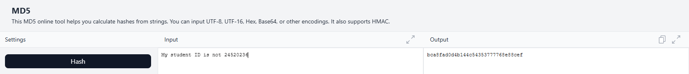
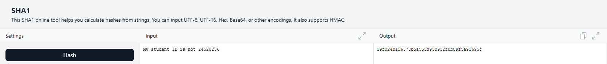
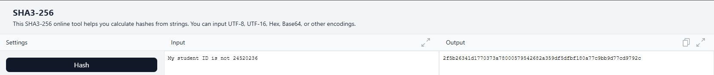
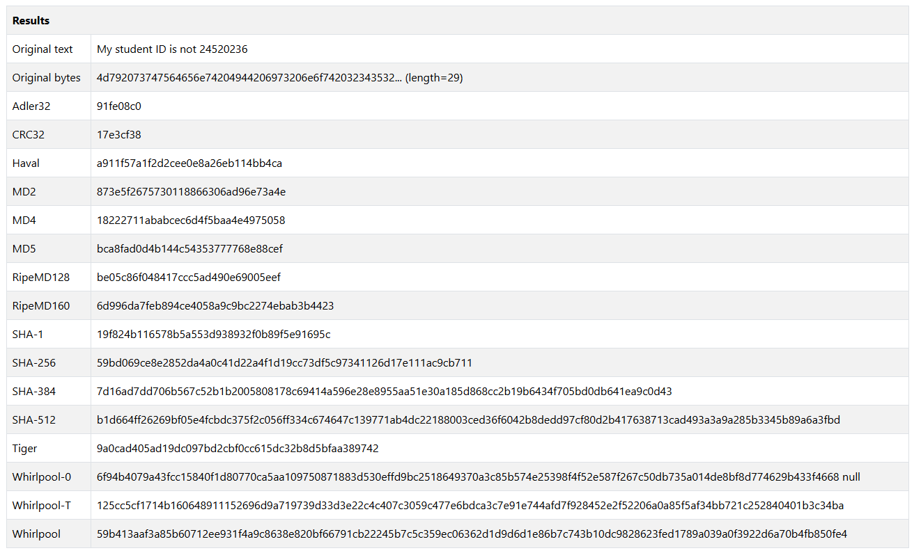

# Mật mã học - NT219.Q11.ANTN.1 - Lab 4

## Báo cáo thực hành Lab 4
### 1. Generating message digests (hash values) and HMAC

#### Description
Your task is to write an application (with C/C++) to calculate hash values (at least
three different types: MD5, SHA-1/SHA-2, SHA-3). For an input, which could be:
- Text string
- Hex string
- File (support both text and binary files)

You can use any hash library for your chosen programming language. Then, test
your application with the following exercise:
1. Generate the hash values of the arbitrary message which contains your
student ID. Then compare the results with other tools to verify.
2. Create three files which size up to 10 KB, 10 MB, and 10 GB. Generate hash
values of these files.

#### Script
```cpp
#include <bits/stdc++.h>
#include "hash-library/md5.h"
#include "hash-library/sha1.h"
#include "hash-library/sha3.h"

using namespace std;

vector<unsigned char> hex_to_bytes(const string& hex) {
    if (hex.length() % 2 != 0)
        throw invalid_argument("Chuỗi hex phải có số ký tự chẵn.");

    vector<unsigned char> bytes;
    bytes.reserve(hex.length() / 2);

    for (size_t i = 0; i < hex.length(); i += 2) {
        string byte_string = hex.substr(i, 2);
        try {
            unsigned char byte = static_cast<unsigned char>(stoul(byte_string, nullptr, 16));
            bytes.push_back(byte);
        } catch (const exception& e) {
            throw invalid_argument("Ký tự hex không hợp lệ trong chuỗi.");
        }
    }
    return bytes;
}

void hash_algo(const string& alg_name, istream& is) {
    vector<char> buffer(4096); // Đọc 4KB mỗi lần

    if (alg_name == "md5") {
        MD5 hasher;
        while (is.good()) {
            is.read(buffer.data(), buffer.size());
            streamsize bytes_read = is.gcount();
            if (bytes_read > 0) {
                hasher.add(buffer.data(), bytes_read);
            }
        }
        cout << hasher.getHash() << endl;
    } 
    else if (alg_name == "sha1") {
        SHA1 hasher;
        while (is.good()) {
            is.read(buffer.data(), buffer.size());
            streamsize bytes_read = is.gcount();
            if (bytes_read > 0) {
                hasher.add(buffer.data(), bytes_read);
            }
        }
        cout << hasher.getHash() << endl;
    } 
    // Xử lý các biến thể SHA3
    else if (alg_name == "sha3") {
        SHA3 hasher;
        while (is.good()) {
            is.read(buffer.data(), buffer.size());
            streamsize bytes_read = is.gcount();
            if (bytes_read > 0) {
                hasher.add(buffer.data(), bytes_read);
            }
        }
        cout << hasher.getHash() << endl;
    }
    else {
        cerr << "Lỗi: Thuật toán "<< alg_name << " không được hỗ trợ.\n";
        cerr << "Các thuật toán được hỗ trợ: md5, sha1, sha3\n";
    }
}

void usage(const char* prog_name) {
    cerr << "Cách dùng: " << prog_name << " <thuật toán> <kiểu> <đầu vào>\n";
    cerr << "  <thuật toán>: md5, sha1, sha3\n";
    cerr << "  <kiểu>:\n";
    cerr << "    -s  Đầu vào là một chuỗi văn bản (string)\n";
    cerr << "    -h  Đầu vào là một chuỗi hex (hex string)\n";
    cerr << "    -f  Đầu vào là một đường dẫn tệp (file path)\n";
    cerr << "  Ví dụ:\n";
    cerr << "    " << prog_name << " sha3 -s \"hello world\"\n";
    cerr << "    " << prog_name << " md5 -h \"68656c6c6f20776f726c64\"\n";
    cerr << "    " << prog_name << " sha1 -f ./my_file.txt\n";
}

int main(int argc, char* argv[]) {
    if (argc != 4) {
        usage(argv[0]);
        return 1;
    }

    const string alg_name = argv[1];
    const string type = argv[2];
    const string input = argv[3];

    try {
        if (type == "-s") {
            stringstream ss(input);
            hash_algo(alg_name, ss);
        } else if (type == "-h") {
            vector<unsigned char> bytes = hex_to_bytes(input);
            stringstream ss;
            ss.write(reinterpret_cast<const char*>(bytes.data()), bytes.size());
            hash_algo(alg_name, ss);
        } else if (type == "-f") {
            ifstream ifs(input, ios::binary);
            if (!ifs) {
                cerr << "Lỗi: Không thể mở tệp: " << input << endl;
                return 1;
            }
            hash_algo(alg_name, ifs);
        } else {
            cerr << "Lỗi: Kiểu đầu vào không xác định '" << type << "'" << endl;
            usage(argv[0]);
            return 1;
        }
    } catch (const exception& e) {
        cerr << "Đã xảy ra lỗi: " << e.what() << endl;
        return 1;
    }

    return 0;
}
```

#### Result
```
➜  Lab4 git:(main) ✗ ./sol1
Cách dùng: ./sol1 <thuật toán> <kiểu> <đầu vào>
  <thuật toán>: md5, sha1, sha3
  <kiểu>:
    -s  Đầu vào là một chuỗi văn bản (string)
    -h  Đầu vào là một chuỗi hex (hex string)
    -f  Đầu vào là một đường dẫn tệp (file path)
  Ví dụ:
    ./sol1 sha3 -s "hello world"
    ./sol1 md5 -h "68656c6c6f20776f726c64"
    ./sol1 sha1 -f ./my_file.txt
```
```
➜  Lab4 git:(main) ✗ ./sol1 md5 -s Cryptographyispain  
3aa14f9b127f1d09fa6f1f60f5e7f72b
➜  Lab4 git:(main) ✗ ./sol1 sha1 -h 18375192871623ab 
84980e4529bcfe9b574ba37a1678aec93585f7c3
➜  Lab4 git:(main) ✗ ./sol1 sha3 -f ./README.md     
15580317c140fc77f066df5dc1d247ef085078dc5ad63cfce59f08cd6f2d204e
```
**Verify the program**

With program:
```
➜  Lab4 git:(main) ✗ ./sol1 md5 -s "My student ID is not 24520236"
bca8fad0d4b144c54353777768e88cef
➜  Lab4 git:(main) ✗ ./sol1 sha1 -s "My student ID is not 24520236"
19f824b116578b5a553d938932f0b89f5e91695c
➜  Lab4 git:(main) ✗ ./sol1 sha3 -s "My student ID is not 24520236"
2f5b26341d1770373a78000579542682a359df5dfbf180a77c9bb9d77cd9792c
```
With another tools:

1. https://emn178.github.io/online-tools/




2. https://www.fileformat.info/tool/hash.htm

```
Verification completed, results are exactly the same!!!
```
**Create three files which size up to 10 KB, 10 MB, and 10 GB.**
```
➜  Lab4 git:(main) ✗ dd if=/dev/zero of=10KB.bin bs=1K count=10
10+0 records in
10+0 records out
10240 bytes (10 kB, 10 KiB) copied, 0.000100605 s, 102 MB/s
➜  Lab4 git:(main) ✗ dd if=/dev/zero of=10MB.bin bs=1M count=10 
10+0 records in
10+0 records out
10485760 bytes (10 MB, 10 MiB) copied, 0.0255705 s, 410 MB/s
➜  Lab4 git:(main) ✗ dd if=/dev/zero of=10GB.bin bs=1G count=10
10+0 records in
10+0 records out
10737418240 bytes (10 GB, 10 GiB) copied, 31.9278 s, 336 MB/s
```
**Generate hash values**
```
➜  Lab4 git:(main) ✗ ./sol1 md5 -f ./10KB.bin                        
1276481102f218c981e0324180bafd9f
➜  Lab4 git:(main) ✗ ./sol1 sha1 -f ./10KB.bin
34e163be8e43c5631d8b92e9c43ab0bf0fa62b9c
➜  Lab4 git:(main) ✗ ./sol1 sha3 -f ./10KB.bin
bf56af56a5662ab7c1c37f3f7812b08a406cd7cc65d22d0a7baa20bbc183fd3b
➜  Lab4 git:(main) ✗ ./sol1 md5 -f ./10MB.bin 
f1c9645dbc14efddc7d8a322685f26eb
➜  Lab4 git:(main) ✗ ./sol1 sha1 -f ./10MB.bin
8c206a1a87599f532ce68675536f0b1546900d7a
➜  Lab4 git:(main) ✗ ./sol1 sha3 -f ./10MB.bin
50b7513f2a2a2eb9687a07917bff807247f43ae715fa58b7c8e5620c947c814a
➜  Lab4 git:(main) ✗ ./sol1 md5 -f ./10GB.bin 
2dd26c4d4799ebd29fa31e48d49e8e53
➜  Lab4 git:(main) ✗ ./sol1 sha1 -f ./10GB.bin
a0b6e2ca4e28360a929943e8eb966f703a69dc44
➜  Lab4 git:(main) ✗ ./sol1 sha3 -f ./10GB.bin
5ee23bea04250435bbf6cb702029d525e162ee06aa430960927fdd78da674bbf
```
### 2. Hash properties: One-way vs Collision-free
#### Description
It is now well-known that the cryptographic hash function MD5 and SHA-1 has been
clearly broken (in terms of collision-resistance property). We will find out about MD5
and SHA-1 collision in this task by doing the following exercises:
1. Consider two HEX messages as follow:

**Message 1**
```
d131dd02c5e6eec4693d9a0698aff95c2fcab58712467eab4004583eb8fb7f89
55ad340609f4b30283e488832571415a085125e8f7cdc99fd91dbdf280373c5
b
d8823e3156348f5bae6dacd436c919c6dd53e2b487da03fd02396306d248cda
0
e99f33420f577ee8ce54b67080a80d1ec69821bcb6a8839396f9652b6ff72a70
```
**Message 2**
```
d131dd02c5e6eec4693d9a0698aff95c2fcab50712467eab4004583eb8fb7f89
55ad340609f4b30283e4888325f1415a085125e8f7cdc99fd91dbd7280373c5
b
d8823e3156348f5bae6dacd436c919c6dd53e23487da03fd02396306d248cda
0
e99f33420f577ee8ce54b67080280d1ec69821bcb6a8839396f965ab6ff72a70
```
How many bits/bytes are the diffirent between two messages? Let’s generate
MD5 hash values for each message. Please observe whether these MD5 are
similar or not and describe your observations in the lab report.

2. Download two PDF files: shattered-1 and shattered-2.pdf:
- shattered-1.pdf: https://shattered.io/static/shattered-1.pdf
- shattered-2.pdf: https://shattered.io/static/shattered-2.pdf

    Open these files to check the difference. Then generate SHA-1 hash for them and
observe the result.

3. Draw the conclusion base on your observations. Could you explain the reasons
for the existence of collision in MD5 and SHA-1?

#### Solution
1. In this homework, I use python for comparison and previous project to calculate hash value.
#### Script
```python
import subprocess

msg1 = "d131dd02c5e6eec4693d9a0698aff95c2fcab58712467eab4004583eb8fb7f8955ad340609f4b30283e488832571415a085125e8f7cdc99fd91dbdf280373c5bd8823e3156348f5bae6dacd436c919c6dd53e2b487da03fd02396306d248cda0e99f33420f577ee8ce54b67080a80d1ec69821bcb6a8839396f9652b6ff72a70"
msg2 = "d131dd02c5e6eec4693d9a0698aff95c2fcab50712467eab4004583eb8fb7f8955ad340609f4b30283e4888325f1415a085125e8f7cdc99fd91dbd7280373c5bd8823e3156348f5bae6dacd436c919c6dd53e23487da03fd02396306d248cda0e99f33420f577ee8ce54b67080280d1ec69821bcb6a8839396f965ab6ff72a70"
bytes1 = bytes.fromhex(msg1)
bytes2 = bytes.fromhex(msg2)

count = 0
for a, b in zip(bytes1, bytes2):
    if a != b: count += 1
print(f'There are {count} bytes different between two messages\n')

run_hash1 = ["./sol1", "md5", "-h", msg1]
run_hash2 = ["./sol1", "md5", "-h", msg2]
res1 = subprocess.run(run_hash1, capture_output=True, text=True).stdout.strip()
res2 = subprocess.run(run_hash2, capture_output=True, text=True).stdout.strip()
print("------------------Comparing Hashes------------------")
assert res1 == res2, "These hashes are not the same"
print(f'They are the same!!! Here is the value {res1}')
```
#### Result
```
There are 6 bytes different between two messages

------------------Comparing Hashes------------------
They are the same!!! Here is the value 79054025255fb1a26e4bc422aef54eb4
```

2. The two PDF files have different content, namely one file has a blue background, the other has a red background. Let's check their SHA-1 hash.
```python
import subprocess

run_hash1 = ["./sol1", "sha1", "-f", "./shattered-1.pdf"]
run_hash2 = ["./sol1", "sha1", "-f", "./shattered-2.pdf"]
res1 = subprocess.run(run_hash1, capture_output=True, text=True).stdout.strip()
res2 = subprocess.run(run_hash2, capture_output=True, text=True).stdout.strip()
print("------------------Comparing Hashes------------------")
assert res1 == res2, "These hashes are not the same"
print(f'They are the same!!! Here is the value {res1}')
```
```
------------------Comparing Hashes------------------
They are the same!!! Here is the value 38762cf7f55934b34d179ae6a4c80cadccbb7f0a
```

3. From my point of view, it exists two messages which after hashing turn out to be the same.

    Collisions exist in MD5 and SHA-1 because their fixed, shorter output sizes make it mathematically possible for two different inputs to produce the same hash value, a vulnerability that can be exploited through specific attacks. 